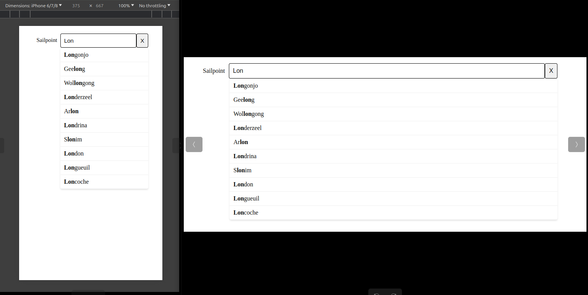

# Autocomplete Component

<!-- TABLE OF CONTENTS -->
## Table of Contents
- [Lucy Chen - Autocomplete Component](#lucy-chen---autocomplete-component)
  - [Table of Contents](#table-of-contents)
  - [Introduction](#introduction)
  - [Features](#features)
  - [Getting Started](#getting-started)
    - [Run in Docker](#run-in-docker)
    - [Run in Local](#run-in-local)

<!-- ABOUT THE PROJECT -->
## Introduction
This project is a full-stack application comprising a Node.js backend and an Angular frontend, implementing an autocomplete component. 
The application is containerised using Docker and Docker Compose to ensure consistency across different environments and ease of deployment.

<!-- ABOUT THE FEATURES -->
## Features


- **Performance**: Limit query results to 10 items for both mobile and desktop versions.
- **Query Matching**: Ensure query results match the search text, with matched text styled differently (e.g., bold).
- **Desktop UX**: Avoid using a scrollbar for query results to enhance user experience.
- **Hover/Focus State**: Adjust the style (e.g., bold) of query results when hovered or focused.
- **Spacing**: Maintain appropriate spacing of query results to enhance visual space.

<!-- GETTING STARTED -->
## Getting Started

There are two different ways to run the application. To set up a local copy, please follow these simple steps.

### Run in Docker
**Prerequisites**
- Docker
- Docker Compose

**Steps**
1. **Navigate to the parent directory of the project**:
   ```sh
   cd lucychen-exercise - UI
   ```

2. **Build and start the application using Docker Compose**:
   ```sh
   docker-compose up -d
   ```
3. **Access the application**:
   ```
    http://localhost:4200
   ```
4. **Stop the application using Docker Compose**:
   ```sh
   docker-compose down
   ```
### Run in Local
**Prerequisites**
- Angular 18
- Nodejs <18.20.3

**Steps**
1. **Navigate to the parent directory of the project**:
   ```sh
   cd lucychen-exercise - UI
   ```
2. **Install node_modules**
   ```sh
   npm install
   ```
3. **Navigate to the backend directory**
   ```sh
   cd backend
   ```
4. **Run backend server**
   ```sh
   node server.js
   ```
5. **Navigate to the frontend directory**
   ```sh
   cd ..
   cd frontend
   ```
6. **Open the other terminal to run frontend server**
   ```sh
   npm run start
   ```
